# uiu 界面导览

> 图都由 `python scripts/tui_preview.py` 生成：用**假 client 驱动真实界面**，不需要模型也不需要网络。
> textual 的 headless 导出是 **256 色降级**结果——**布局与排版可信，配色仅供参考**；要确认颜色请直接跑 `uiu`。
>
> 重新生成：`python scripts/tui_preview.py`（全部）或 `python scripts/tui_preview.py --only palette`。

## 1. 首屏

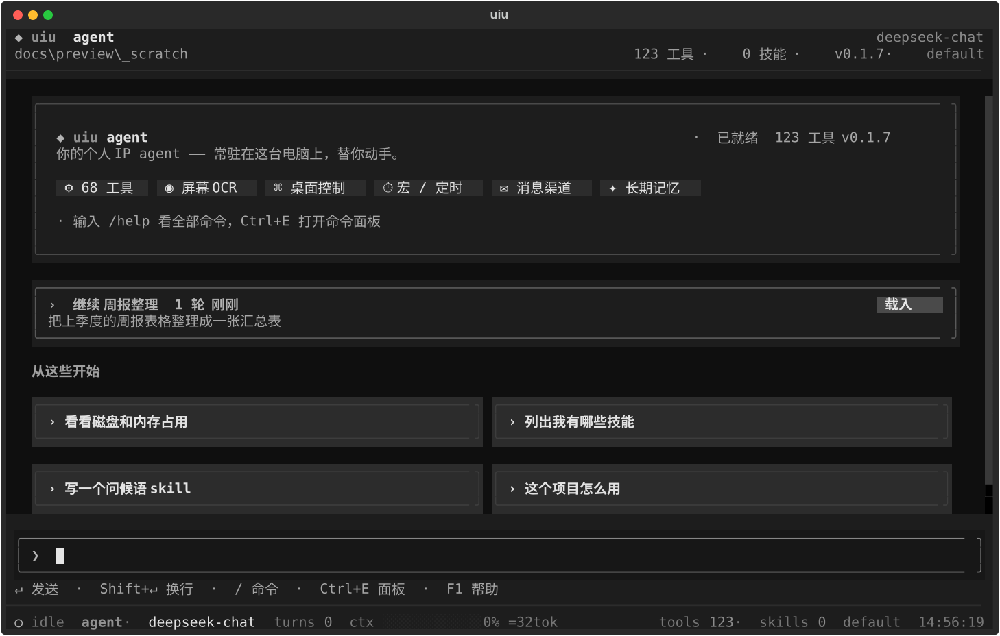

品牌卡（字标 + 定位语 + 能力徽章 + 就绪状态）、「从这些开始」建议卡，
有已存会话时顶部还会多一张**继续上次会话**卡片（会话名 / 轮数 / 上次时间 / 最后那句提问）。

## 2. 对话与流式

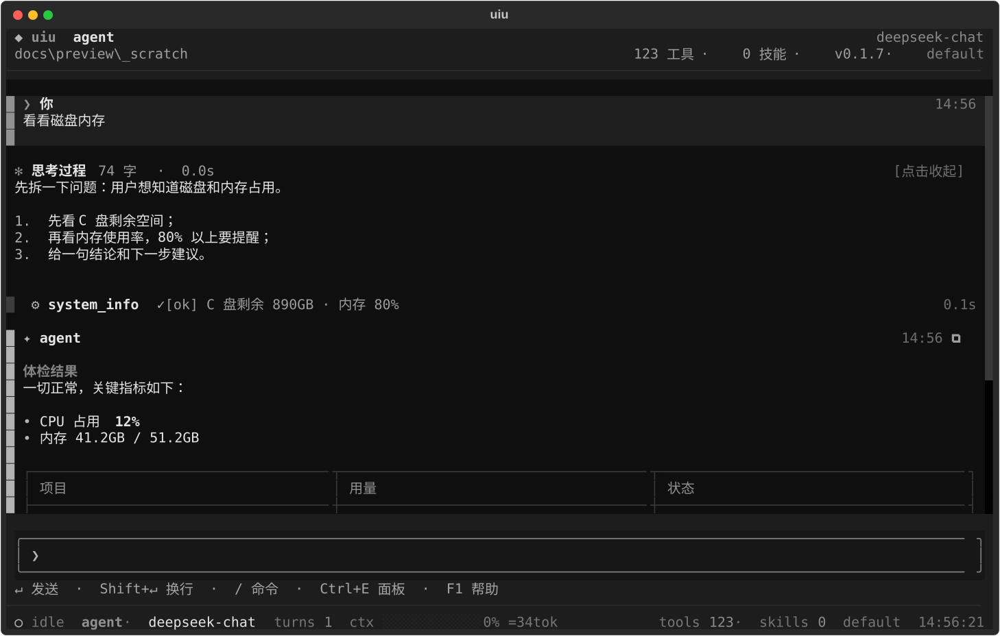

每条消息带角色字形、名字、时间戳与左侧角色色竖线；回答流式期间头部显示 `正在生成…`、
行尾有 `▍` 光标；每条回答右上角有 `⧉` 复制按钮；Markdown 的代码块、表格、引用都有专门排版。

## 3. 推理与工具

思考块显示 `✻ 思考过程 N 字 · 耗时`（长思考回合结束后自动收起，点击展开）；
工具调用发出即渲染 `⚙ 名 ⠋ 运行中`，返回后原地变成 `✓ 摘要 …… 耗时`，点击展开完整入参与返回。
两类行都有手型光标与悬停底色。

## 4. 长会话折叠

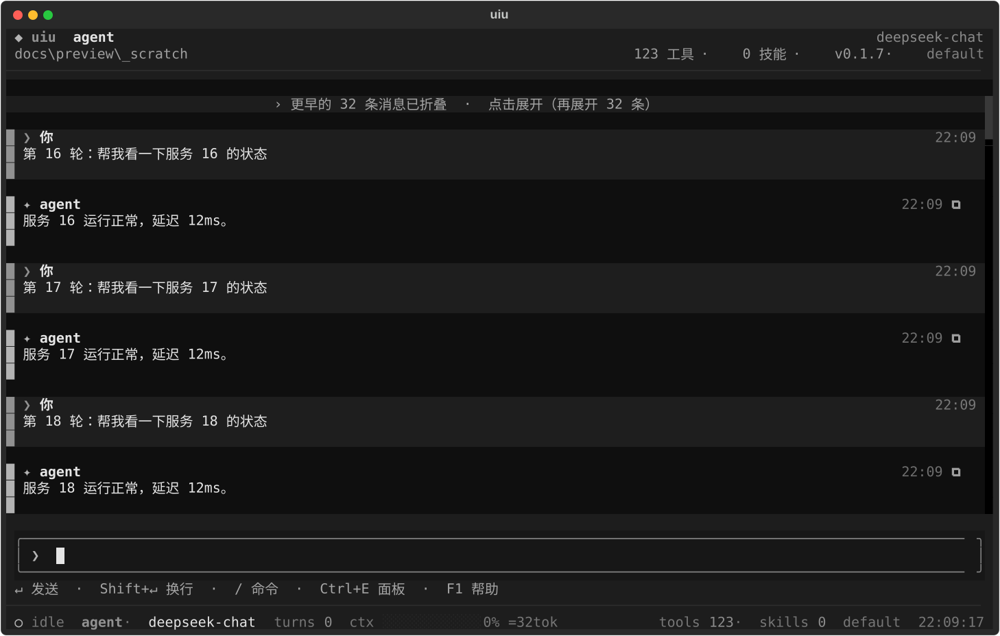

消息区常驻最近 60 条，更早的折成顶部一行 `› 更早的 N 条消息已折叠 · 点击展开`。
**滚到顶部会自动补一页**（每次 60 条，硬上限 400），并且用「锚点行」把视口钉在原位，不会被顶走。

## 5. 命令输出折叠

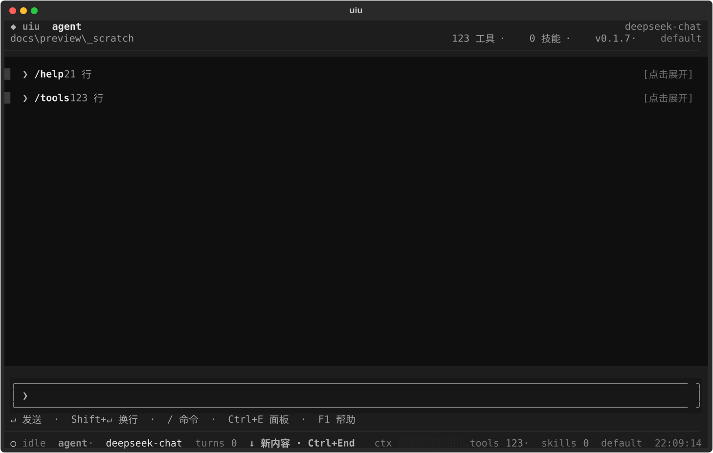

`/help`（21 行）、`/tools`（123 行）这类输出折成一行，展开后是等宽对齐的代码块。

## 6. 检索

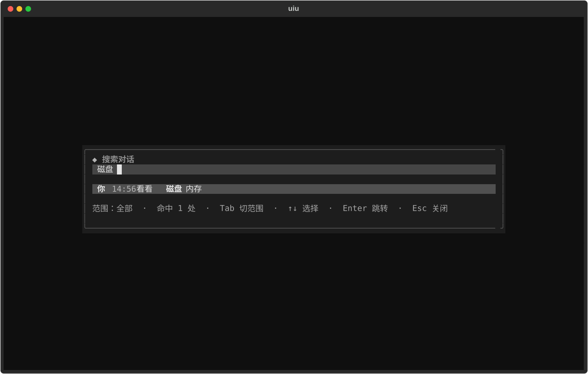

`Ctrl+R` 检索当前对话（含折叠的命令输出）：命中词加粗、底部显示范围与命中数，
`Tab` 切换范围（全部 / 对话 / 命令输出），Enter 跳转，之后 `F3` / `Shift+F3` 逐个命中。
`/search <关键词>` 是跨会话检索（输入即搜，Enter 打开会话）。

## 7. 命令面板

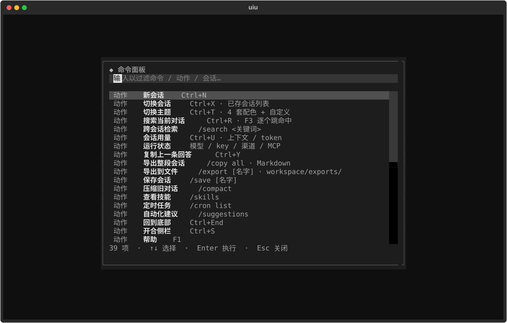

`Ctrl+E`：**动作**（新会话 / 切换会话 / 切换主题 / 搜索 / 用量 / 状态 / 复制 / 导出 / 回到底部…）、
**最近会话**、全部 **slash 命令**三类合一的模糊面板，左侧标类别、右侧是快捷键或说明；
本次会话用过的条目会自动提到最前。

## 8. 会话切换

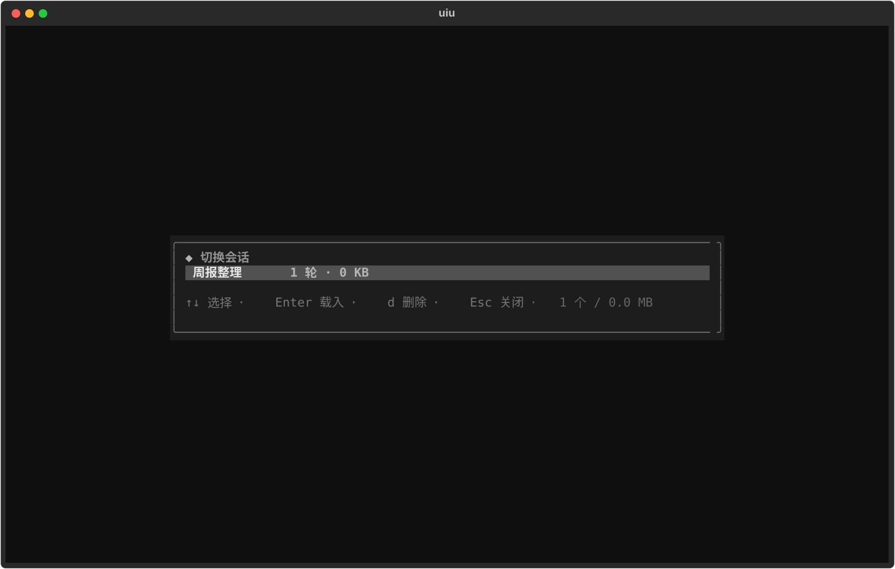

`Ctrl+X`：列出已存会话（轮数 + 当前标记），Enter 载入并重渲染历史，`d` 删除。
**每个会话的滚动位置会被记住**，切回来还在原处。

## 9. 用量与状态

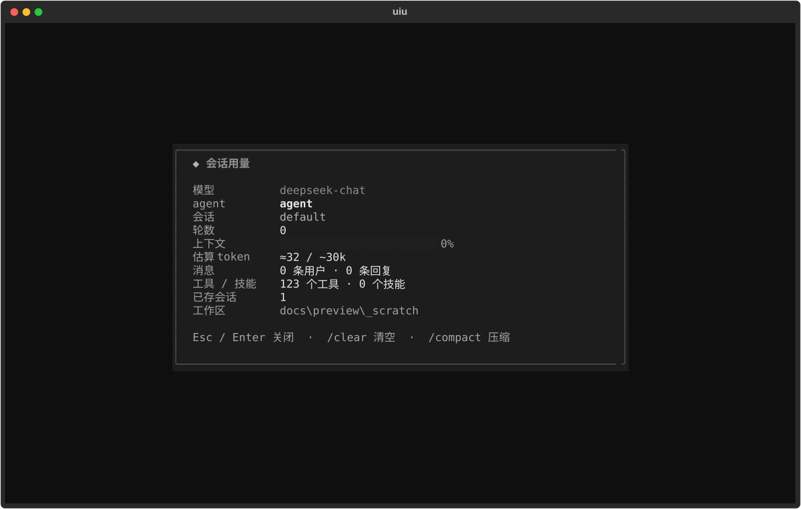

`Ctrl+U` 会话用量：模型 / 会话 / 轮数 / 上下文进度条 / token 估算 / 消息数 / 工具技能数 / 工作区。

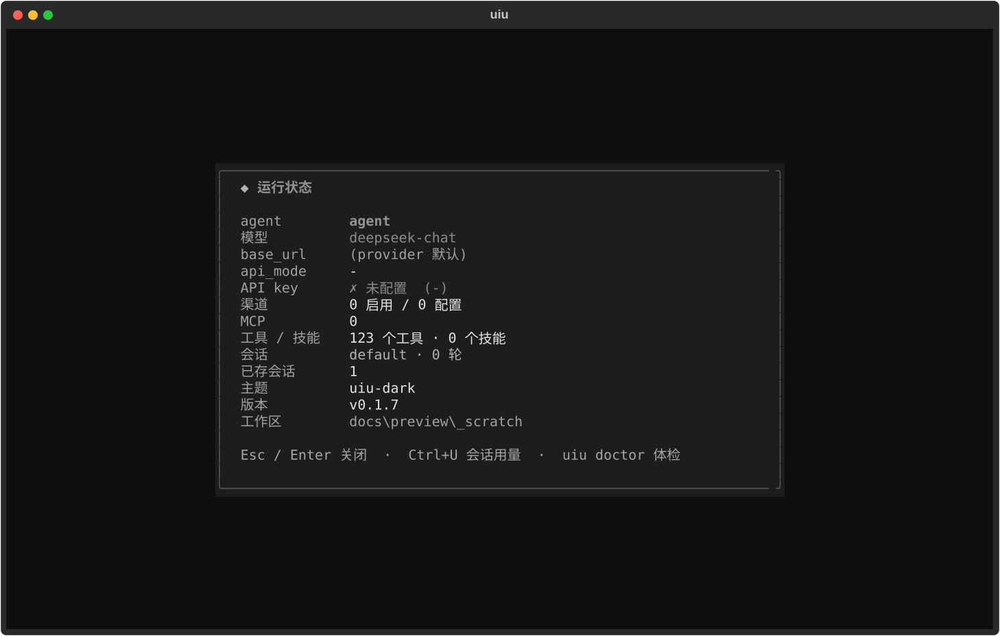

`/status` 运行状态：agent / 模型 / base_url / api_mode / **API key 是否就位** / 渠道 / MCP / 主题 / 版本 / 工作区。

## 10. 窄终端

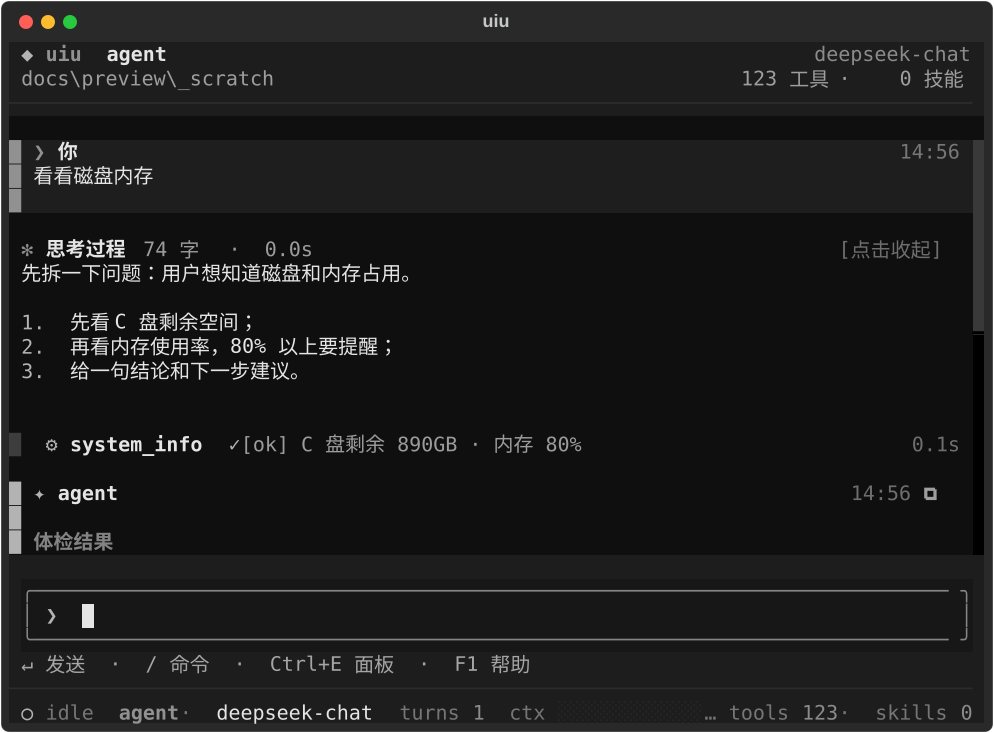

`<88` 列自动收起侧栏（变宽还原）、`<74` 列顶栏收成单行、状态条按宽度分档丢信息、
输入区提示行与首屏徽章/建议卡同步收缩。

## 11. 帮助

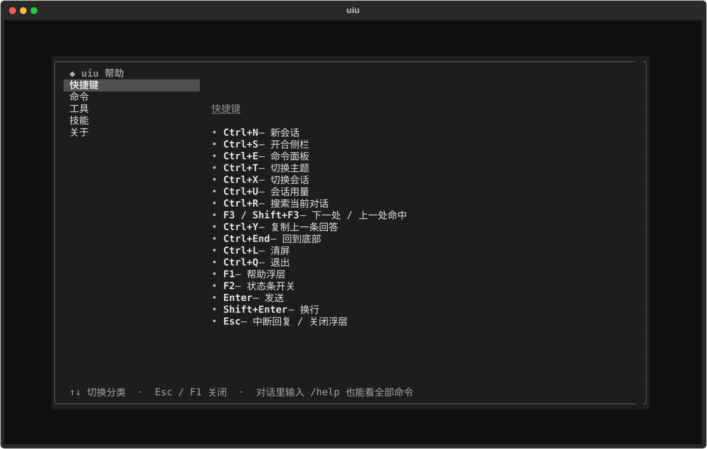

`F1`：左侧分类导航（快捷键 / 命令 / 工具 / 技能 / 关于），右侧可滚动正文。

## 其他能力（截图不体现）

- **主题**：4 套内置配色 + `tui.colors` 自定义（写进 `config.yaml`），`uiu config --theme/--color` 可命令行设置，
  `uiu doctor --fix` 能修非法主题/色位。
- **不卡顿**：agent 回合与斜杠命令都在工作线程里跑，慢命令期间界面照常响应。
- **轻提示**：复制、主题切换等瞬时反馈只出现在状态条，3 秒自动消失，不往对话里塞气泡。
- **导出**：`/export [名字]` 把会话写成 Markdown 落到 `workspace/exports/`。
